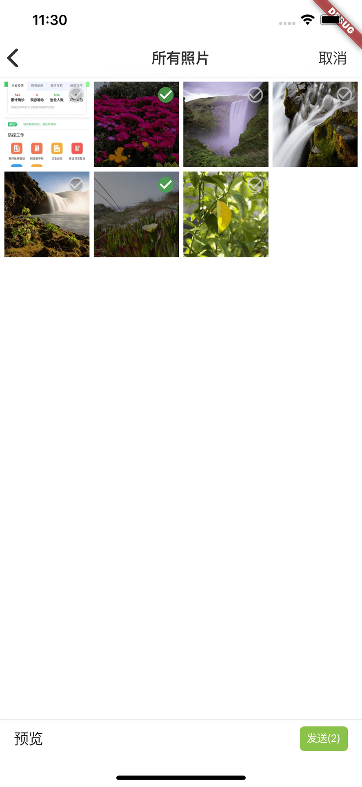

# asset_picker

用于选择和拍摄照片的插件，支持ios和android.

## Screenshots

 
 

## Usage

# 引入

```yaml
  dependencies:
    flutter:
      sdk: flutter
    asset_picker:
    #本地路径
      path: /**/flutter_asset_picker
	#或者git地址
#	  git:
#       url: git://github.com/cdworks/flutter_asset_picker.git
```

# 示例
```dart
showAssetPickNavigationDialog(
        maxNumber: 5,  //选取图片最大数量
        context: context,
        textColor: widget.textColor, //导航栏文本颜色
        photoDidSelectCallBack: (assets) { //回调返回选择的照片信息
          if (assets != null) {
            setState(() {
              widget.photos.addAll(assets);
            });
          }
        });

//展示缩略图
AssetThumbImage(
    width: width,
    height: height,
    asset: asset,
)

//展示原图
AssetOriginalImage(
        asset: asset,
        fit: BoxFit.contain,
        picSizeWidth: picWidth ~/3.6, //缩略图宽度
        quality: 80, //压缩率
        width: width == asset ? 0: width, 
        height: height == asset ? 0: height,

      )

//获取数据
  asset.getImageByteData(quality: 60, width: 0, height: 0);
//注意 asset可以获取路径，asset.path. android 表示本地路径，ios则表示标志，不是本地路径

```